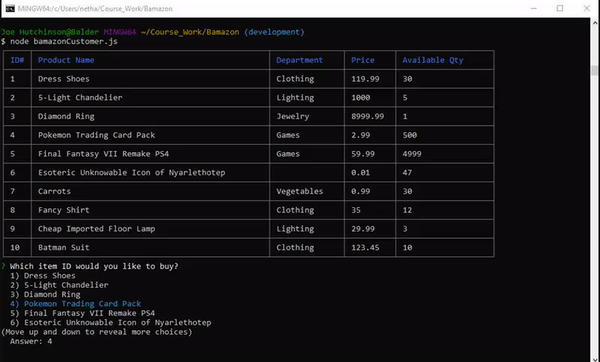

# Bamazon

Bamazon is a console-based program that simulates a highly simplified online retail site.  It utilizes a SQL database to store product information, and relies on Node.js packages to facilitate user interaction. 

Through the bamazonCustomer.js program, the user can view available products and purchase the desired quantity of items provided there is sufficient inventory in stock.

## Getting Started

This app is a command-based program that can be run on GitBash or Terminal; it is not run on a browser.  You will need to have VSCode or similar editor along with GitBash/Terminal.  Store all the files you download within the same folder.

You will also need to have Node.js and several npm packages installed.  See installation section for details.  Lastly, you will need to have MySQL installed along with the corresponding npm package.

In the console, navigate to the folder where the .js files are stored.  To run the customer program, simple type the following in the command line: node bamazonCustomer index.js

### Prerequisites

The data can be pulled directly from GitHub via GitBash on PC or via Terminal on Mac.  If you are new to this process, please follow the directions below:

When you have accessed the repository page on GitHub, you may simply download a Zip file and extract it to a directory of your choosing.  Alternatively, you may download the data directly to your device via GitBash if you have an SSH key.  More on adding an SSH key can be found here: https://help.github.com/en/enterprise/2.15/user/articles/adding-a-new-ssh-key-to-your-github-account

To download via GitBash, once you have a working SSH key with GitHub, create a folder you wish to download data into.  Next, click on the green 'Download or Clone' button on the GitHub respoitory page.  Make sure you have SSH key selected(and not HTTPS), and click on the clipboard icon.  This copies the address to your clipboard.

Next, navigate to the folder you wish to download the data into via GitBash or Terminal, and then simply type "git clone" followed by the link you copied onto your clipboard(paste via ctrl/cmd+v).  Press the enter key, and GitBash will pull the entire repository into your folder.

Additionally, you will need to have Node.js installed.  This can be done here: https://nodejs.org/en/

### Installing

Once you have the repository cloned, you will need to install a number of npm packages before you can begin using the program.  You will also need to have MySQL Workbench installed.

Begin with adding a folder for node_modules by typing the following in the command line: npm init

Next you will need to install each package used for LIRI Bot.  This can be done by typing each of the following into the command line:

* npm install
* npm install mysql
* npm install inquirer
* npm install cli-table
* npm install chalk

After you have each of the npm packages installed, you will need to create the database on MySQL Workbench.  Once the program is opened, navigate to your local instance tab and bring up a blank query tab.  Copy the information from the bamazon.sql file into the query tab.  Click on the execute(lightning bolt) icon and refresh the schemas page.  You should now have a bamazon database available.

Lastly, you will want to make sure the js file(s) are configured correctly for your system.  Carefully look over the connection information and make sure that both the port number and password match what you have on your MySQL Workbench account.

## Instructions

### bamazonCustomer.js

Type in 'node bamazonCustomer.js' to begin the customer purchase program.  You will see a list of available items and be prompted to select one from the available list.  Once you have selected a product, you will be prompted with the next questin specifying the quantity you would like to purchase.

If there is sufficient quantity in stock, you will receive a message that the item has been purchased, and be asked if you would like to shop again.  If you choose to do so, you will see the quanity you specified is now subtracted from the total inventory of the item you purchased.

If you enter a desired amount that is higher than the currently available quantity, you will receive a message that there is insufficient stock, and be prompted if you would like to try shopping again or quit the program.

## Testing

This program can be tested through use of the command console(GitBash/Terminal, etc.).  Simply add console.log under any section you wish to examine the results from in the console.
  

## Deployment

Navigate to https://github.com/ to clone.  Carefully follow the installation instructions above.

## Built With

Visual Studio Code: https://code.visualstudio.com/  
Node.js: https://nodejs.org/en/
MySQL: https://www.mysql.com/

## Contributing

Feel free to fork the repository for your own study.  If you would like to learn more about how I constructed this project you may also message me via GitHub.

## Versioning

Use github for version control (https://github.com/your/project/tags).

## Author

* **Joe Hutchinson**

## Acknowledgments

Thank you Cameron Paige for recommending the cli-table npm package for this project.  

* Joe Rehfuss
* Trae Shanks
* Lan Truong

Thank you again to my Coding Boot Camp instructors for all of the support and constructive feedback.